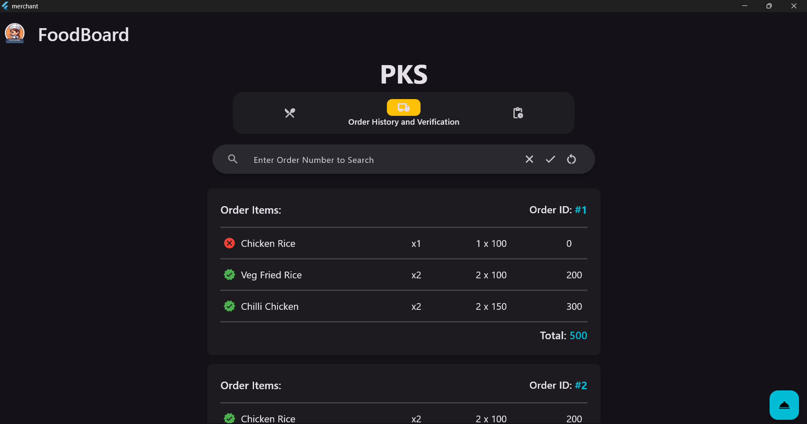
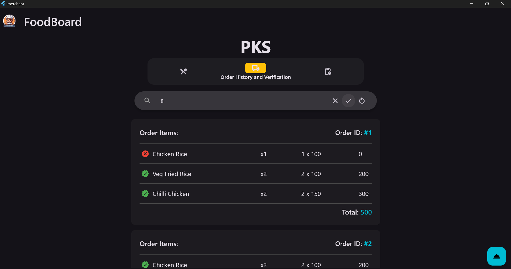
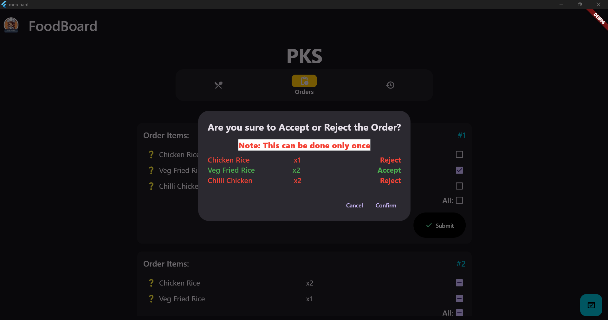
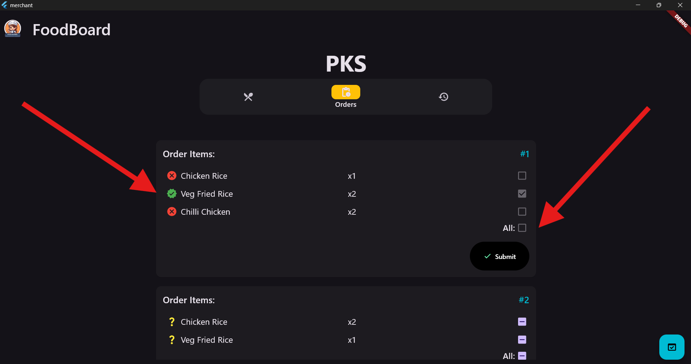
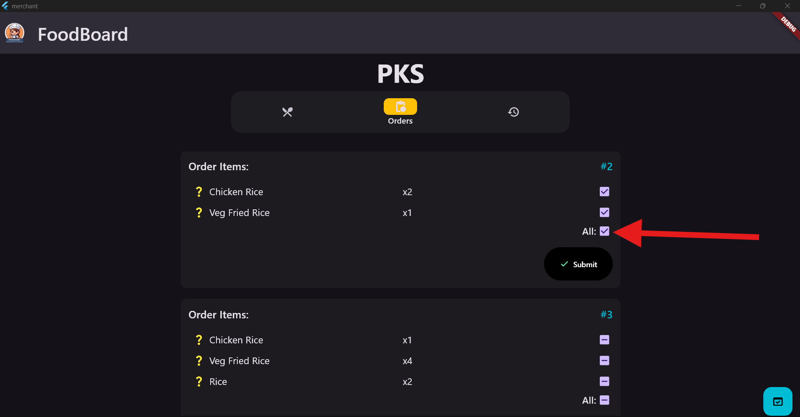
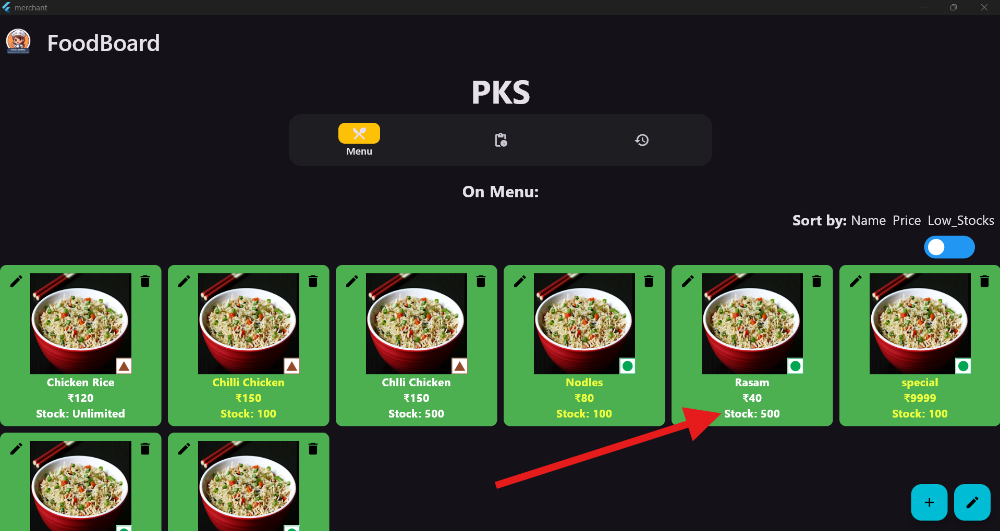

# Xs-merchant

Features:

 - Introduced Stocks count on grid on Menu Page and edit and modify stocks too
 - Changed Sort by Veg to Low_stocks(Look 2(4) or image-18)

1. Orders Page

 - Selected a Particular item to Accept the order

 - After clicking Submit

 

  - After clicking Confirm(Buttons need a better UI)

  

 - Selecting all items to be Accepting or Rejecting at once with this button

 

2. Sort:

 - Sort by Name by default:

 - Sort by Price:
 

 - Sort by Low_Stocks:

 - Sort Toggle in Not on Menu too, for easy access

3. Modify Item in Bulk with Name Checkpoint

4. Single Modify Items for Changing the both Name and Price

 - When Changed

5. Added Reconfirmation for Easy Adding and removing items from Menu
 - On Menu to Off Menu

 - Off Menu to On menu

 

6. Add New item rework with checkpoint

- When Changed

7. Added Delete Item Feature:

